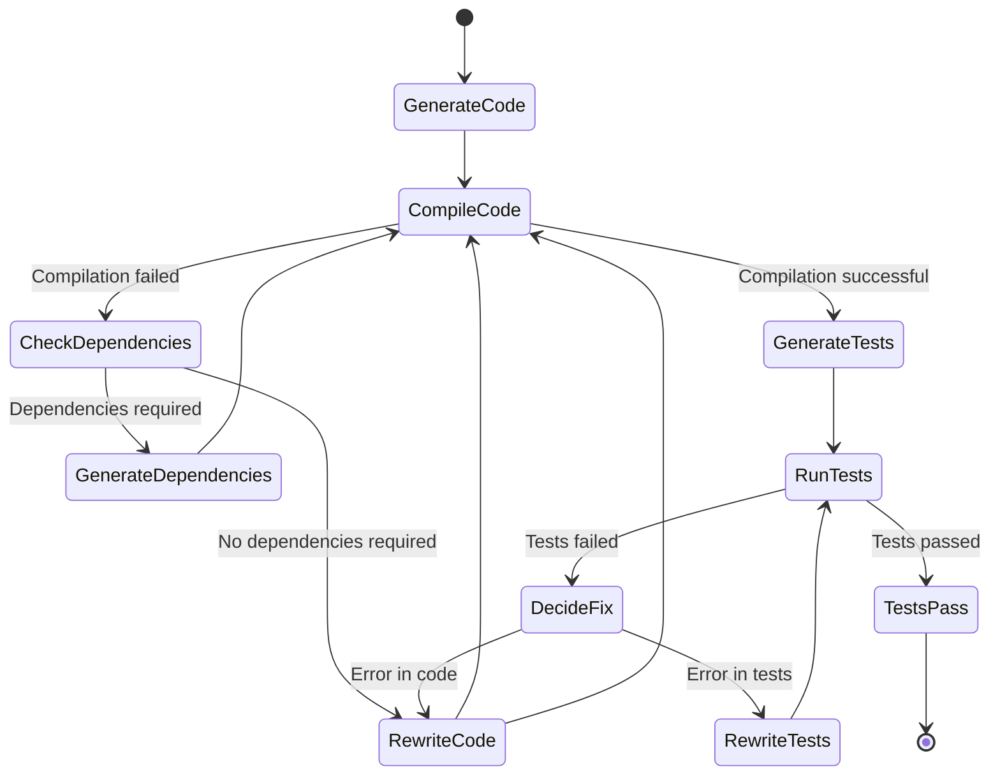
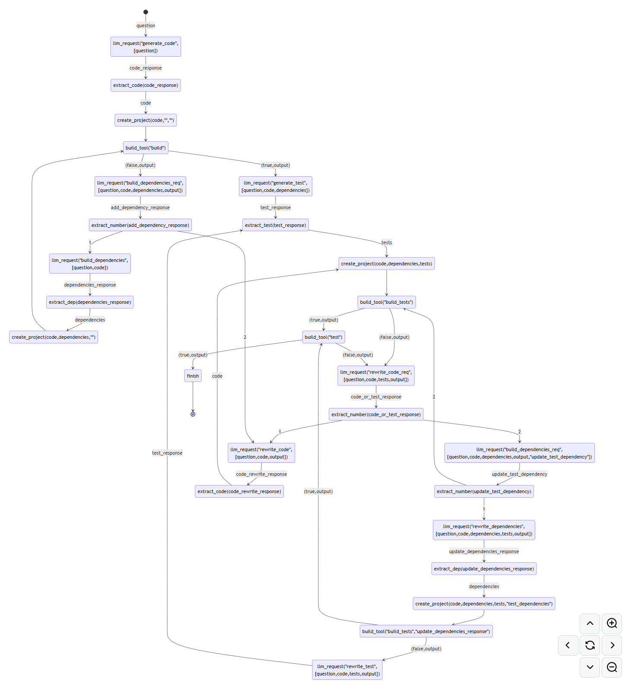

# rustsn

A Rust-based tool that automates the generation, compilation, and testing of Rust code using  Large Language Models (LLMs). It interacts with LLMs to generate code based on user-provided explanations, compiles the code, resolves dependencies, and runs tests to ensure functionality.

## Project name explanation

Project name "rustsn" is a combination of "Rust" and "Snippet" words. Code snippets are generated by the tool.


## Features

- **Code Generation**: Generates Rust functions based on user explanations using LLMs.
- **Automated Compilation**: Compiles the generated code and handles compilation errors.
- **Dependency Resolution**: Determines and adds necessary dependencies to `Cargo.toml`.
- **Test Generation**: Creates tests for the generated code using LLMs.
- **Error Correction**: Iteratively rewrites code or tests to fix errors until successful compilation and testing.
- **Caching Mechanism**: Implements caching to store and retrieve previous computations for efficiency.

## How it works



## Installation

### Prerequisites

- **Rust**: Ensure you have Rust installed. You can install it from [here](https://www.rust-lang.org/tools/install).
- **Ollama (Optional)**: Required for LLM interactions. Install from [Ollama's official site](https://ollama.ai/).
  - Download Ollam model (Optional) 
   ```bash
   ollama run gemma2:27b
   ```
   After downloading the model, you can say "hello" to the model to check if it is working correctly. 
   After that, you can use type "Ctrl+D" to exit the model.
- **OpenAI API Key (Optional)**: Create file "token.txt" in the root folder and put your OpenAI API key there.

### Clone the Repository

```bash
git clone https://github.com/evgenyigumnov/LLM-Logic-Exec-Verify.git
cd LLM-Logic-Exec-Verify
```

## Usage

1. **Start the Program**

   ```bash
   cargo run
   ```

2. **Provide an Explanation**

   The program will prompt:

   ```
   Explain what the function should do:
   ```

   Enter a detailed explanation of the function you want to generate.
   ```
   parse json string and return struct User (age, name)
   ```
 3. **Automatic Processing**

   The tool will:

- Generate the function code using an LLM.
- Attempt to compile the code.
- If compilation fails, it will check for missing dependencies and attempt to resolve them.
- Generate tests for the function.
- Run the tests and iteratively fix any errors.


4. **Completion**

   Once the code compiles and all tests pass, the final code and tests will be displayed and result of work will be saved in `sandbox` folder.

For example:

```
[dependencies]
serde = { version = "1.0", features = ["derive"] }
serde_json = "1.0"

use serde::{Deserialize, Serialize};

#[derive(Deserialize, Serialize, Debug)]
struct User {
    name: String,
    age: u32,
}

fn solution(json_string: &str) -> Result<User, serde_json::Error> {
    let user: User = serde_json::from_str(json_string)?;
    Ok(user)
}

#[cfg(test)]
mod tests {
    use super::*;

    #[test]
    fn test_solution() {
        let json_string = r#"{"name": "John Doe", "age": 30}"#;
        let user = solution(json_string).unwrap();
        assert_eq!(user.name, "John Doe");
        assert_eq!(user.age, 30);
    }

    #[test]
    fn test_solution_invalid_json() {
        let json_string = r#"{"name": "John Doe", "age": }"#;
        assert!(solution(json_string).is_err());
    }
}

Finished
```


## Example of queries for code generation

```take 2 params and multiply and return result```

```take 1 parameter multiply by random number and return tuple with  result and random number```

```parse json string and return struct User (age, name)```

## Contributing

I would love to see contributions from the community. If you experience bugs, feel free to open an issue. If you would like to implement a new feature or bug fix, please follow the steps:
1. Read "[Contributor License Agreement (CLA)](CLA)"
2. Do "git clone" 
3. Create branch with your pull request
4. Create pull request to main branch

## For contributors




## Versions

### 0.5.0 - Support only Rust code generation 20 September 2024
- Make decision to support only Rust code generation

### 0.4.0 - LLM Generate Result Extraction - 20 September 2024
- Extract_code function replaced by extract_code, extract_dep, extract_test functions

### 0.3.0 - State Machine - 20 September 2024
- Support OpenAI API

### 0.2.0 - State Machine - 19 September 2024
- Moved prompts from code to "rust.prompt" file
- Moved logic from code to "logic.md" file

### 0.1.0 - Prototype - 17 September 2024
- Code Generation
- Automated Compilation
- Dependency Resolution
- Test Generation
- Error Correction
- Caching Mechanism 

