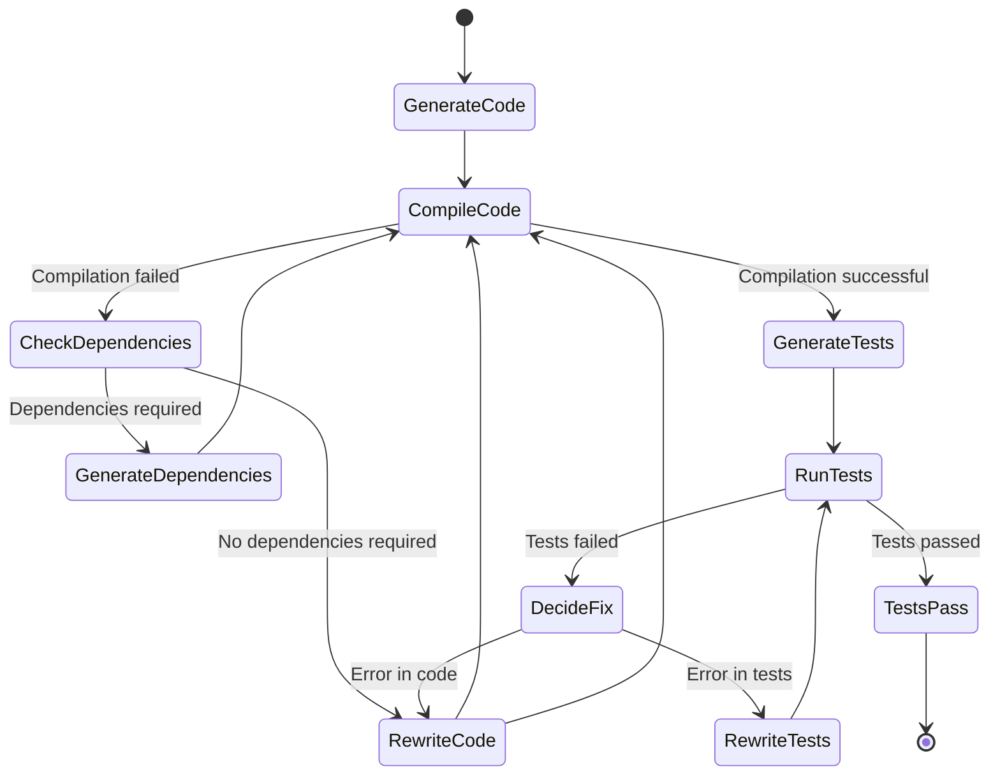

# rustsn - Code snippets generator via LLMs and compiler/tester via build tools

A Rust-based tool that automates the generation, compilation, and testing 
of code using Large Language Models (LLMs). It interacts with LLMs to generate 
code based on user-provided explanations, compiles the code, resolves dependencies, 
and runs tests to ensure functionality.

## Supported languages
- Python
- JavaScript
- Java
- Kotlin
- Swift
- PHP
- Rust
- Scala

## How it works



## Project name explanation

Project name "rustsn" is a combination of "Rust" and "Snippet" words. Code snippets are generated by the tool written in Rust language.


## Installation

### Prerequisites

- **Rust**: Ensure you have Rust installed. You can install it from [here](https://www.rust-lang.org/tools/install).
- **Make a decision**: Use Ollama (free and launched on your machine) or the OpenAI API (paid and launched on OpenAI servers).
- **If you choose Ollama**: Required for LLM interactions. Install from [Ollama's official site](https://ollama.ai/).
  - Download Ollam model  
   ```bash
   ollama run gemma2:27b
   ```
   After downloading the model, you can say "hello" to the model to check if it is working correctly. 
   After that, you can use type "Ctrl+D" to exit the model.
- **If you choose OpenAI API Key**: Create file "token.txt" in the root folder and put your OpenAI API key there.

### Clone the Repository

```bash
git clone https://github.com/evgenyigumnov/rustsn.git
cd rustsn
```

## Usage

1. **Start the Program**

   ```bash
   cargo run -- --lang=rust
   ```

2. **Provide an Explanation**

   The program will prompt:

   ```
   Explain what the function should do:
   ```

   Enter a detailed explanation of the function you want to generate.
   ```
   parse json string and return struct User (age, name)
   ```
 3. **Automatic Processing**

   The tool will:

- Generate the function code using an LLM.
- Attempt to compile the code.
- If compilation fails, it will check for missing dependencies and attempt to resolve them.
- Generate tests for the function.
- Run the tests and iteratively fix any errors.


4. **Completion**

   Once the code compiles and all tests pass, the final code and tests will be displayed and result of work will be saved in `sandbox` folder.

For example:

```
[dependencies]
serde = { version = "1.0", features = ["derive"] }
serde_json = "1.0"

use serde::{Deserialize, Serialize};

#[derive(Deserialize, Serialize, Debug)]
struct User {
    name: String,
    age: u32,
}

fn solution(json_string: &str) -> Result<User, serde_json::Error> {
    let user: User = serde_json::from_str(json_string)?;
    Ok(user)
}

#[cfg(test)]
mod tests {
    use super::*;

    #[test]
    fn test_solution() {
        let json_string = r#"{"name": "John Doe", "age": 30}"#;
        let user = solution(json_string).unwrap();
        assert_eq!(user.name, "John Doe");
        assert_eq!(user.age, 30);
    }

    #[test]
    fn test_solution_invalid_json() {
        let json_string = r#"{"name": "John Doe", "age": }"#;
        assert!(solution(json_string).is_err());
    }
}

Finished
```


## Examples of queries for code generation

1. ```take 2 params and multiply and return result```

2. ```take 1 parameter multiply by random number and return tuple with  result and random number```

3. ```parse json string and return struct User (age, name)```

## Contributing

I would love to see contributions from the community. If you experience bugs, feel free to open an issue. If you would like to implement a new feature or bug fix, please follow the steps:
1. Read "[Contributor License Agreement (CLA)](CLA)"
2. Do fork 
3. Add comment to the [issue](https://github.com/evgenyigumnov/rustsn/issues) that you are going to work on it
4. Create pull request

## Versions
### 0.14.0 - Swift 23 September 2024
- Add Swift language support

### 0.13.0 - Kotlin 23 September 2024
- Add Kotlin language support

### 0.12.0 - Python 22 September 2024
- Add Python language support

### 0.11.0 - PHP 22 September 2024
- Add PHP language support
 
### 0.10.0 - JavaScript 22 September 2024
- Add JavaScript language support

### 0.9.0 - Scala 22 September 2024
- Add Scala language support

### 0.8.0 - Java 22 September 2024
- Add Java language support

### 0.7.0 - Simplification 22 September 2024
- Simplify state machine logic and remove logic.md file
- Simplify prompt.txt file

### 0.6.0 - Add "clap" crate 21 September 2024
- Add --lang parameter to specify the language of the generated code (Rust, Python, C, JavaScript, Java, TypeScript, CPP, Scala, Kotlin, Swift)

### 0.5.0 - Support multi-language code generation 21 September 2024
- Make decision to support multi-language code generation: Python, C, JavaScript, Java, TypeScript, CPP, Scala, Kotlin, Swift

### 0.4.0 - LLM Generate Result Extraction - 20 September 2024
- Extract_code function replaced by extract_code, extract_dep, extract_test functions

### 0.3.0 - State Machine - 20 September 2024
- Support OpenAI API

### 0.2.0 - State Machine - 19 September 2024
- Moved prompts from code to "rust.prompt" file
- Moved logic from code to "logic.md" file

### 0.1.0 - Prototype - 17 September 2024
- Code Generation
- Automated Compilation
- Dependency Resolution
- Test Generation
- Error Correction
- Caching Mechanism 

