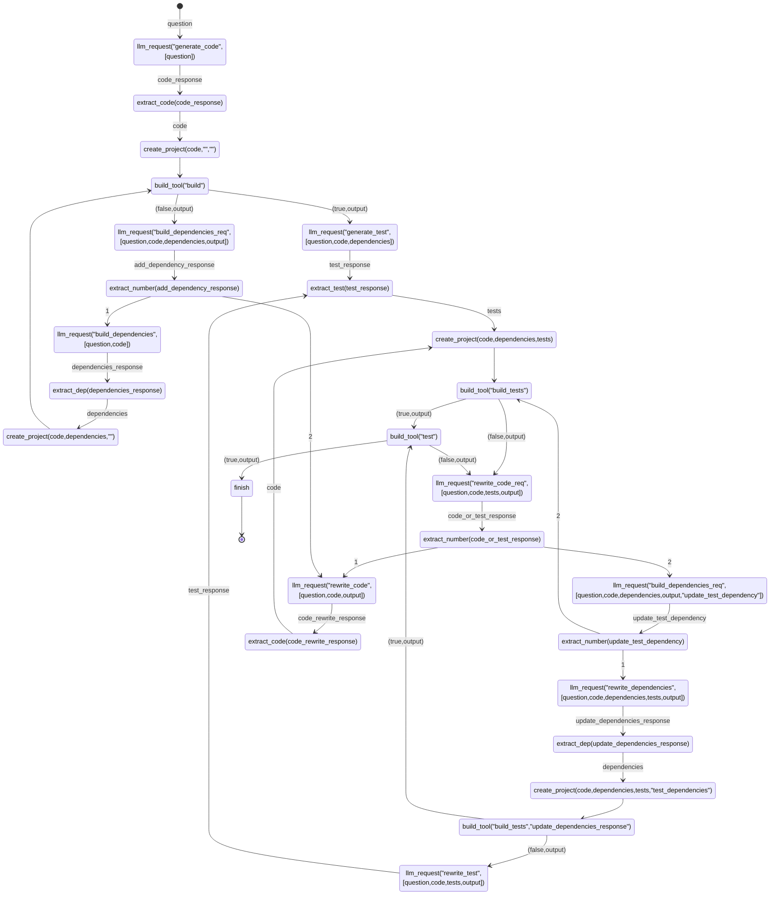

```mermaid
stateDiagram
[*] --> llm_request("generate_code",[question]) : question
llm_request("generate_code",[question]) --> extract_code(code_response) : code_response
extract_code(code_response) --> create_project(code,"","") : code
create_project(code,"","") --> build_tool("build")
create_project(code,dependencies,"") --> build_tool("build")
create_project(code,dependencies,tests) --> build_tool("build_tests")
build_tool("build_tests") --> build_tool("test") : (true,output)
build_tool("build_tests") --> llm_request("rewrite_code_req",[question,code,tests,output]) : (false,output)
build_tool("test") --> finish : (true,output)
build_tool("test") --> llm_request("rewrite_code_req",[question,code,tests,output]) : (false,output)
llm_request("rewrite_code_req",[question,code,tests,output]) --> extract_number(code_or_test_response) : code_or_test_response
extract_number(code_or_test_response) --> llm_request("rewrite_code",[question,code,output]) : 1
extract_number(code_or_test_response) -->  llm_request("build_dependencies_req",[question,code,dependencies,output,"update_test_dependency"]): 2
llm_request("build_dependencies_req",[question,code,dependencies,output,"update_test_dependency"]) --> extract_number(update_test_dependency) : update_test_dependency
extract_number(update_test_dependency) --> llm_request("rewrite_dependencies",[question,code,dependencies,tests,output]) : 1
extract_number(update_test_dependency) --> build_tool("build_tests") : 2
llm_request("rewrite_dependencies",[question,code,dependencies,tests,output]) --> extract_dep(update_dependencies_response) : update_dependencies_response
extract_dep(update_dependencies_response) --> create_project(code,dependencies,tests,"test_dependencies") : dependencies
create_project(code,dependencies,tests,"test_dependencies") --> build_tool("build_tests","update_dependencies_response")
build_tool("build_tests","update_dependencies_response") --> build_tool("test"): (true,output)
build_tool("build_tests","update_dependencies_response") --> llm_request("rewrite_test",[question,code,tests,output]): (false,output)
llm_request("rewrite_test",[question,code,tests,output]) --> extract_test(test_response) : test_response
llm_request("rewrite_code",[question,code,output]) --> extract_code(code_rewrite_response) : code_rewrite_response
extract_code(code_rewrite_response) --> create_project(code,dependencies,tests): code
build_tool("build") --> llm_request("generate_test",[question,code,dependencies]) : (true,output) 
build_tool("build") --> llm_request("build_dependencies_req",[question,code,dependencies,output]) : (false,output) 
llm_request("build_dependencies_req",[question,code,dependencies,output])  --> extract_number(add_dependency_response) : add_dependency_response
extract_number(add_dependency_response) --> llm_request("rewrite_code",[question,code,output]) : 2
extract_number(add_dependency_response) --> llm_request("build_dependencies",[question,code]) : 1
llm_request("build_dependencies",[question,code]) --> extract_dep(dependencies_response) : dependencies_response
extract_dep(dependencies_response) --> create_project(code,dependencies,"") : dependencies 
llm_request("generate_test",[question,code,dependencies]) --> extract_test(test_response) : test_response
extract_test(test_response) --> create_project(code,dependencies,tests) : tests
finish --> [*]
``` 